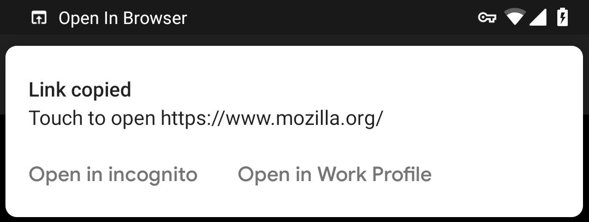
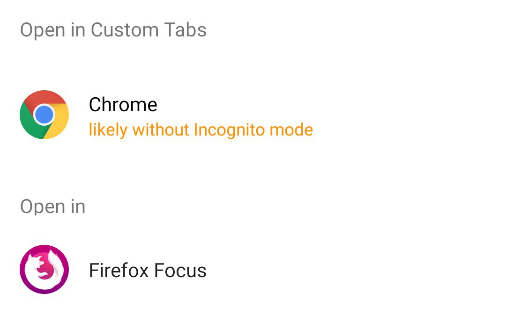

# Open in browser

Listen to your clipboard. Open it in browser.

In incognito mode, or in managed profile.

## Requirements

-   Android version: At least **Android 9** (API level 28)
-   Permission _android.permission.INTERACT_ACROSS_USERS_ if you want to open in managed profile

## Screenshot

## Install

Download it as [app-debug.apk](https://github.com/Vola-Studio/Open-in-browser/releases)

> adb install -r ./app-debug.apk
>
> adb shell am start xyz.vola.openinbrowser/.DialogContainer

[Wonder why? Click here](https://developer.android.com/about/versions/pie/power#buckets)

### If you use managed profile

> adb shell am start --user 10 xyz.vola.openinbrowser/.DialogContainer
>
> adb shell pm grant xyz.vola.openinbrowser android.permission.INTERACT_ACROSS_USERS

[Wonder why? Click here](https://source.android.com/devices/tech/admin/multiuser-apps)

## Supported browser

-   Browsers that supports Custom Tabs (Chrome, Firefox, etc...)
-   [DuckDuckGo](https://play.google.com/store/apps/details?id=com.duckduckgo.mobile.android)
-   [Firefox Focus](https://play.google.com/store/apps/details?id=org.mozilla.focus)
